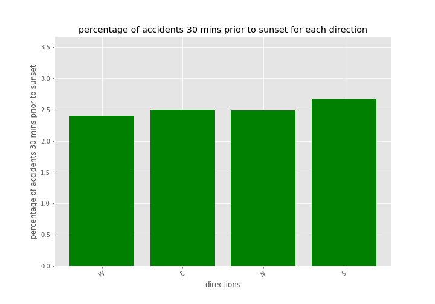
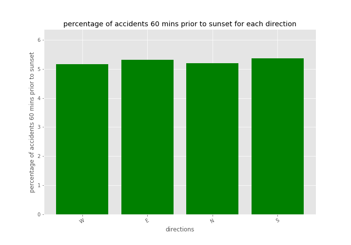

# Driving into the Sunset, Project 1

## Team Members:
* Grant Thompson
* Arundhati Chakraborty
* Shalin Shekhar

## Description of the dataset

   We are exploring a dataset of U.S. traffic accidents collected from      February 2016 to March 2019. There are 2.25 million accident records in the dataset, covering 49 states in the US.

 ### The Dataset includes:

 * Latitude and Longitude
 * Accident Date and Time
 * Weather Conditions 
 * State and time zone
 * Road name and description of accident
 
  Source: https://www.kaggle.com/sobhanmoosavi/us-accidents
  
  

 ### Core Hypothesis:

 * We wanted to see if the glare from the setting sun has an affect on accident prevalence for westbound traffic immediately preceding sunset (30 minutes prior to sunset)
     * Our hypothesis is accident prevalence is higher when driving west   close to sunset, as the glare would affect your visibility. 

* Weather condition has an impact on traffic accident prevalence 
* Higher accident count during rush hour (7am-10am & 4pm-7pm)
 * Higher accident count during weekdays vs. weekends

### Installations:
 * suntime (to calculate the sunset time for each accident location)
 * pytz (convert the sunset time to the local time based on the location  timezone)
 * gmaps (map the location of the accidents)
 
### Plots
#### accidents vs sunset glare for westbound traffic

#### accidents vs weather condition

#### accidents vs rush hour

### google drive location to resources :
  * https://drive.google.com/open?id=1FwEeRJW0OQ3PlUNPLmV7bNR2Os9lsfkN

